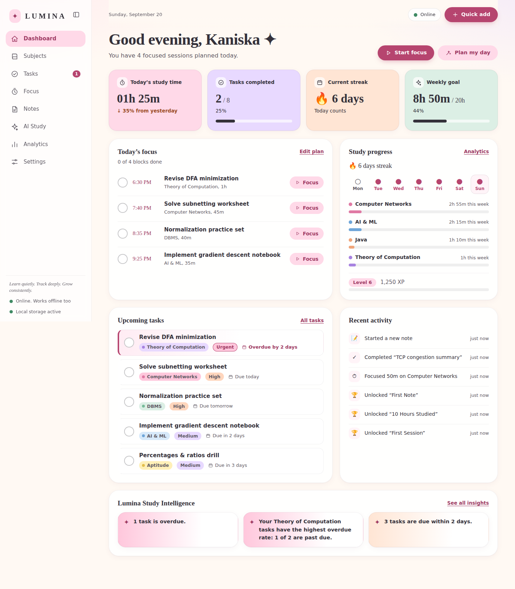
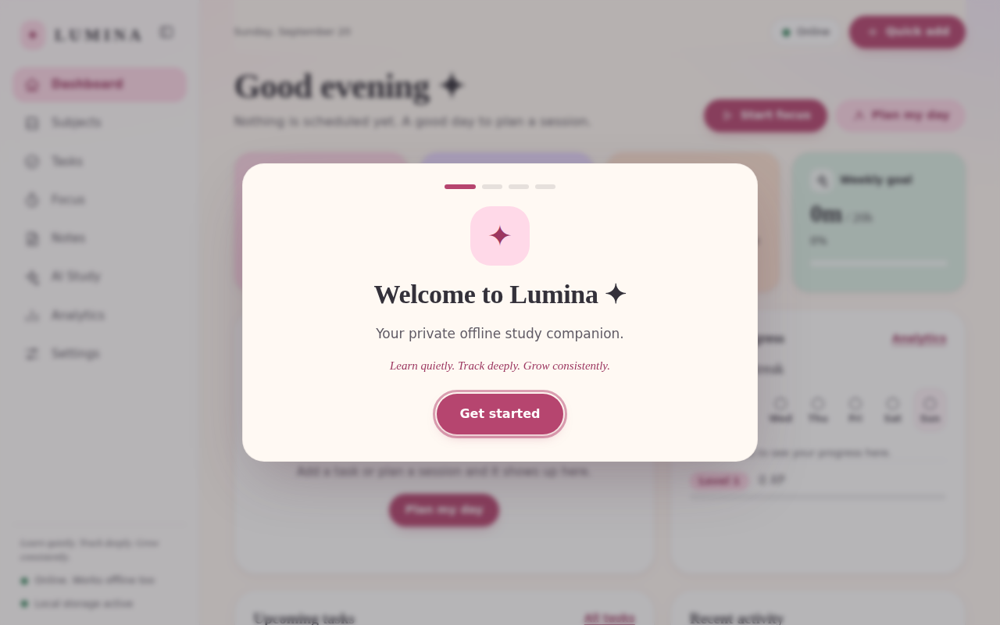
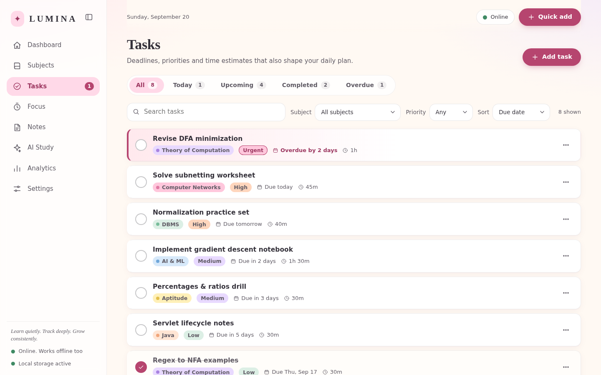
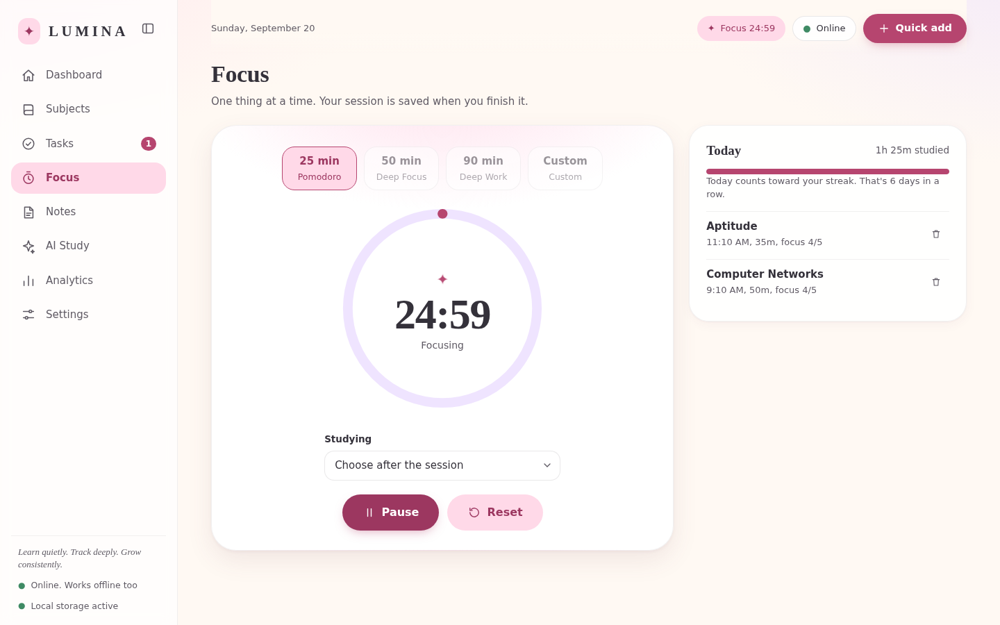
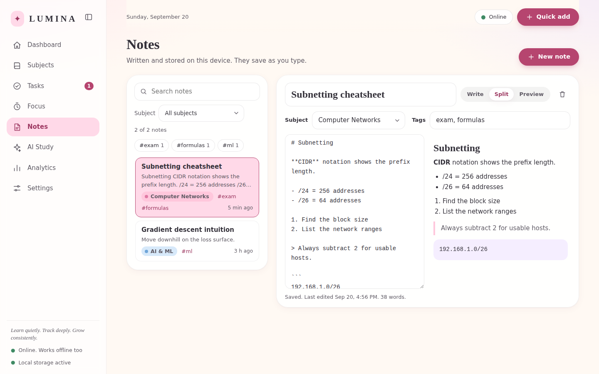
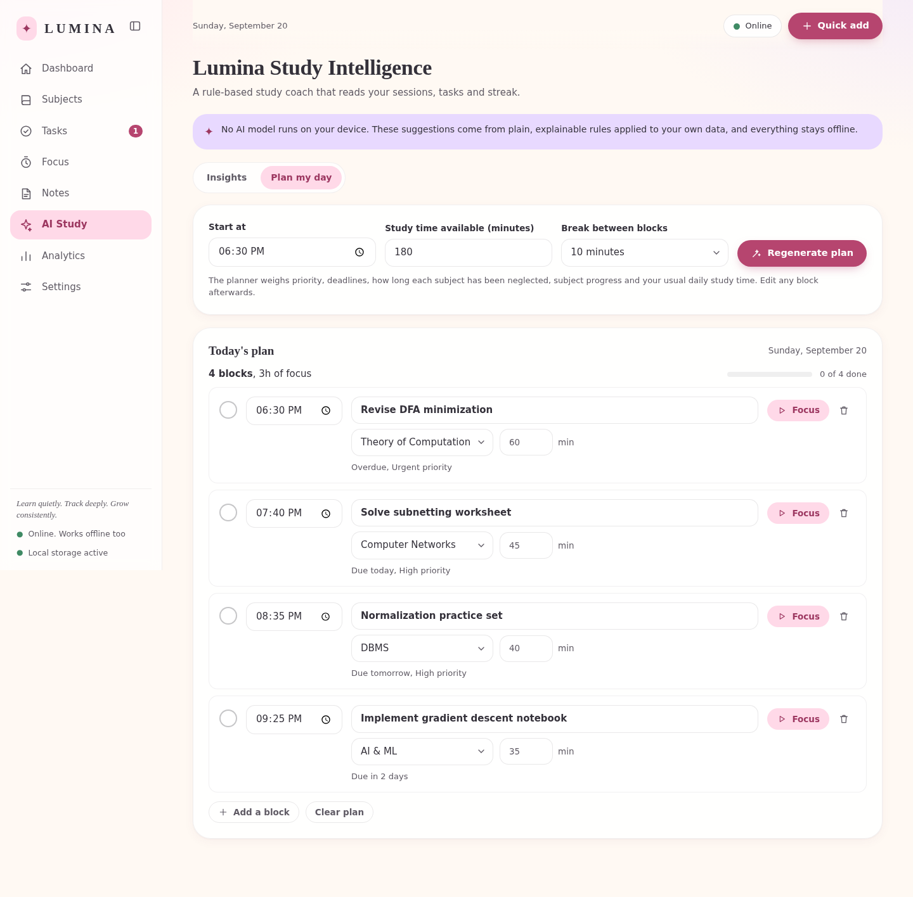
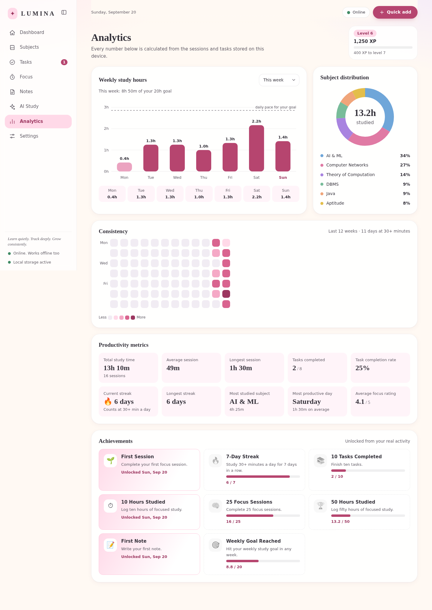
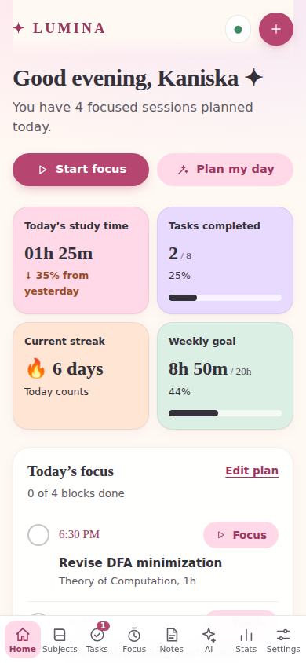
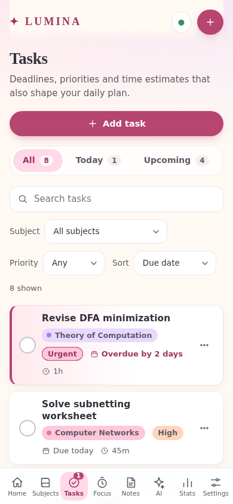
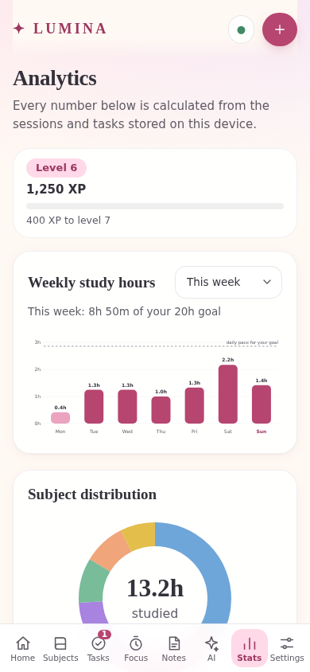

# ✦ Lumina

**Learn quietly. Track deeply. Grow consistently.**

Lumina is an offline-first study dashboard that lives entirely in your browser. It tracks subjects, tasks, focus sessions and notes, turns that history into honest analytics, and suggests what to study next, without an account, a server or an internet connection.



---

## Overview

Open `index.html` and Lumina runs. Everything you enter is stored on your device in IndexedDB (records) and localStorage (small preferences). There is no backend, no analytics, no CDN and no third-party code. It is written in plain HTML, CSS and JavaScript.

## Problem Statement

Most study tools ask for an account, need a connection and keep your data on someone else's server. Students often study on slow campus Wi-Fi, on trains or during power cuts, and they shouldn't lose their timer, notes or streak when the network drops. Lumina is built around three ideas:

1. **It must work with no network**, always.
2. **Your study data is yours.** It stays on your device, and you can export or erase it at any time.
3. **Numbers must be real.** Every figure on screen is computed from what you actually logged. There is no sample data and no invented statistics.

## Features

| Area | What it does |
| --- | --- |
| **Dashboard** | Greeting, today's study time (with change vs. yesterday), tasks completed, current streak, weekly goal progress, today's plan, weekly rhythm, upcoming tasks, recent activity and study insights. |
| **Subjects** | Add, edit and delete subjects with a colour and a target in hours. Each card shows study time, task progress, notes and when you last studied it. Search, filter and sort. |
| **Tasks** | Title, subject, priority (Low, Medium, High, Urgent), due date and time estimate. Tabs for All, Today, Upcoming, Completed and Overdue. Overdue tasks are highlighted. Search, filter, sort and edit. |
| **Focus timer** | Pomodoro 25, Deep Focus 50, Deep Work 90 and Custom. Pause, resume and reset. It survives a page refresh, doesn't drift in a background tab, and plays a soft chime. When a session ends you choose the subject and rate your focus 1 to 5, and the session is saved. |
| **Notes** | Auto-saving notes with Markdown-style formatting (headings, bold, italic, lists, task lists, quotes, code) and a live preview. Tags, subject links and search. |
| **AI Study** | A rule-based study coach: insights about neglected subjects, deadlines and streaks, plus **Plan My Day**, which lays out time blocks you can edit. See the honesty note below. |
| **Analytics** | Weekly study chart, subject distribution donut, 12-week consistency heatmap, productivity metrics and achievements, all drawn as native SVG. |
| **Gamification** | Streaks, XP, levels and eight achievements, all derived from real activity. |
| **Backup and privacy** | One-click JSON export, import with validation and a confirmation step, drag-and-drop import, a Privacy Center and a guarded "Clear All Data". |
| **Reminders** | Optional study reminders 10 minutes before a planned block, using system notifications where allowed and in-app toasts otherwise. |
| **Polish** | Online/offline indicator, first-run onboarding, three accent themes, collapsible sidebar, responsive layout with a bottom navigation bar on phones, keyboard support and reduced-motion support. |

> **A note on "AI".** Lumina Study Intelligence is **not** a machine-learning model. It is a transparent set of rules (scoring by priority, deadline pressure, neglect and progress) applied to your own data. The app says so on the AI Study page. Nothing is uploaded, and no model runs on your device.

## Architecture

```
lumina/
├── index.html            # App shell: sidebar, top bar, <main id="view">, script tags
├── css/
│   ├── style.css         # Design tokens, layout, components, page styles
│   ├── responsive.css    # Laptop, tablet and mobile (bottom navigation below 900px)
│   └── animations.css    # Subtle motion, all disabled for prefers-reduced-motion
├── js/
│   ├── utils.js          # Dates, formatting, Markdown renderer, UI kit (modal, toast, dropdown, tabs)
│   ├── db.js             # IndexedDB data-access layer (the only file that touches IndexedDB)
│   ├── state.js          # In-memory state, preferences, subscriptions, CRUD wrappers
│   ├── notifications.js  # Reminders (Notification API with in-app fallback)
│   ├── analytics.js      # Streaks, totals, XP and achievements, SVG charts, Analytics page
│   ├── intelligence.js   # Rule-based insights and the Plan My Day scheduler, AI Study page
│   ├── backup.js         # Export, import and validation, clear data, Privacy Center page
│   ├── subjects.js       # Subjects page
│   ├── tasks.js          # Tasks page
│   ├── timer.js          # Focus timer and session saving
│   ├── notes.js          # Notes page
│   ├── dashboard.js      # Dashboard page
│   └── app.js            # Bootstrap, router, onboarding, Settings page
├── screenshots/
└── README.md
```

**Modules, not frameworks.** Each file is an IIFE that registers itself on a single `window.Lumina` namespace (`Lumina.db`, `Lumina.state`, `Lumina.analytics`, and so on). Each page exports a small view object, `{ title, render(root), update(), destroy() }`, and the router in `app.js` mounts it.

**Classic scripts, not ES modules.** Browsers block `import` on `file://` URLs, so ES modules would break the "just double-click `index.html`" requirement. Script order in `index.html` is the dependency order.

**Event delegation.** Markup carries `data-click`, `data-input`, `data-change` and `data-submit` attributes, and one delegated listener per event type dispatches to registered handlers. Pages can re-render freely without re-attaching listeners.

**Rendering.** Views build HTML strings, and every user-supplied value goes through `esc()`. There is no `innerHTML` with raw user text. The Markdown renderer escapes first and formats second.

## Technology Stack

- **HTML5**, **CSS3** (custom properties, grid, flexbox, `prefers-reduced-motion`, safe-area insets)
- **Vanilla JavaScript (ES2020)**, with no framework, no build step and no dependencies
- **IndexedDB** for records, **localStorage** for small preferences and the running timer
- **Web Audio API** for the completion chime (no audio files)
- **Notification API** (optional) for reminders
- **Native SVG** for every chart
- System font stacks only, so nothing is fetched from the network

## IndexedDB Design

Database `lumina-db`, version `1`. Records have string ids from `crypto.randomUUID()` (with a fallback).

| Store | Key | Indexes | Record |
| --- | --- | --- | --- |
| `subjects` | `id` | `name` | `{ id, name, color, description, targetHours, createdAt }` |
| `tasks` | `id` | `subjectId`, `dueDate` | `{ id, title, subjectId, priority, dueDate, estimatedMinutes, completed, createdAt, completedAt }` |
| `sessions` | `id` | `subjectId`, `date`, `startedAt` | `{ id, subjectId, subjectName, startedAt, endedAt, durationSec, plannedMinutes, mode, productivity, date }` |
| `notes` | `id` | `subjectId`, `updatedAt` | `{ id, title, content, subjectId, tags[], createdAt, updatedAt }` |
| `settings` | `key` | none | `{ key, value, updatedAt }` (achievement unlock times, daily plans, last backup date) |
| `activity` | `id` | `at` | `{ id, type, text, at }` |

- Every write runs in a transaction and resolves **after `oncomplete`**, so a resolved promise means the data is durable.
- Dates are stored as local `YYYY-MM-DD` strings (`date`, `dueDate`), so streaks and "today" behave correctly across time zones and daylight-saving changes.
- The schema upgrade path (`onupgradeneeded`) is idempotent, so adding a store or index later only means bumping `DB_VERSION`.
- `subjectName` is denormalised onto each session so old sessions still read correctly if a subject is later renamed or deleted.

**localStorage keys** (all prefixed `lumina:`): `prefs` (name, weekly goal, accent, sidebar state, last page, notification and sound switches, timer defaults) and `timer` (the running timer, so it survives a refresh).

## State Management

`state.js` holds an in-memory mirror of every store, so screens render synchronously.

```
user action → data-click handler → state.add / update / remove
            → write to IndexedDB (awaited)
            → update in-memory mirror
            → emit(reason) → app.js → currentView.update()
```

- **IndexedDB is the source of truth.** The mirror is loaded once at startup and after imports.
- **Subscriptions.** Views don't poll. `state.subscribe(fn)` is called with the reasons that changed (`tasks`, `sessions`, `prefs` and so on), and the router calls the active view's `update()`.
- **Derived data is never stored.** Streaks, totals, XP, levels, charts and insights are recomputed from raw sessions and tasks on demand. That is why editing or deleting a session immediately and correctly changes every number.
- **The timer is timestamp-based.** It stores an `endAt` time, not a counter, so throttled background tabs can't make it drift, and a refresh restores it exactly.

## Offline Architecture

- No network request is ever made. The repository has no CDN links, web fonts, analytics or remote images (verified in the test run: every request is `file://` or `data:`).
- Because the app is plain files, "offline support" is simply "there is nothing to fetch". There is no service worker to go stale, and no cache to invalidate.
- `navigator.onLine` plus the `online` and `offline` events drive the status indicator. It only *informs* you and never changes behaviour.
- If IndexedDB can't be opened (for example in a private window), Lumina shows a clear message with a retry button instead of failing silently.

## Screenshots

| | |
| --- | --- |
|  |  |
| First-run onboarding | Tasks with overdue highlighting |
|  |  |
| Focus timer | Notes with live Markdown preview |
|  |  |
| Plan My Day | Analytics |

Mobile:

| | | |
| --- | --- | --- |
|  |  |  |

## How It Works

**Streaks.** A day "counts" once you've logged **30 or more minutes** of focus. The current streak is the run of consecutive counting days ending today, or ending yesterday if today hasn't counted yet. Your streak isn't lost until a full day passes.

**XP and levels.** `XP = minutes studied + 20 per session + 15 per completed task + 10 per counting day`. Level *n* needs `150 + 50·(n−1)` XP to advance.

**Achievements.** Eight milestones (first session, 7-day streak, 10 tasks, 10 hours, 25 sessions, 50 hours, first note, weekly goal). Each is *measured* from your data with a progress bar, and unlocks once. Deleting data never removes an unlock you've already earned.

**Plan My Day.** Open tasks are scored by:
- priority,
- deadline pressure (overdue and due-today score highest),
- how long the task's subject has been neglected,
- subject progress against its target.

The top tasks are laid out as time blocks from your chosen start time, sized by your estimates (or a sensible default) and fitted into the time you say you have, with breaks in between. Every block is editable afterwards.

**Insights.** Plain rules over your history, for example "you haven't studied *Java* in 3 days", "you're 28 minutes from keeping your streak alive", or "your best window is 7 to 9 PM". Each insight can link to a useful action.

**Focus timer.** Choose a mode and start. When the time is up (or you use *Finish early*), a dialog asks what you studied and how focused you were. Sessions shorter than one minute aren't saved.

## Privacy Model

- **All data stays on this device.** There are no accounts, no cloud sync, no telemetry and no third-party requests.
- **You're in control.** *Export Data* downloads everything as one JSON file. *Import* validates the file, shows what it contains, and asks before replacing anything. *Clear All Data* requires an explicit confirmation checkbox.
- **Import is defensive.** Files are checked for the right app, a supported version, all required stores, and per-record fields, with specific error messages. Nothing is written until validation passes.
- **Escaped output.** Note content and every user-entered string are escaped before rendering, so pasted HTML or script text is displayed, never executed.
- **Honest about limits.** Data lives in *this browser profile*. Clearing site data or using a different browser or device means starting fresh, so export backups regularly.

## Future Improvements

- Optional encrypted backups (passphrase-protected export)
- A PWA manifest and service worker so it can be installed and launched like an app
- Spaced-repetition flashcards linked to notes
- Recurring tasks and calendar-style planning
- Weekly review summaries and CSV export for analytics
- Custom achievements and goals per subject
- Light and dark theme switching, plus more accent palettes
- Automated regression tests checked into the repository

## Limitations

- **Single device.** There's no sync between browsers or devices. Use export and import to move data.
- **Browser storage is not a vault.** If you clear site data, or the browser evicts storage under disk pressure, data can be lost. Export backups.
- **Not machine learning.** Study Intelligence is rule-based by design. It explains itself but won't discover patterns beyond its rules.
- **Reminders need the app open.** Without a server or service worker, a browser can't wake Lumina up to send a notification. Reminders fire while a Lumina tab is open.
- **Notification permission** depends on the browser and how the page is opened. Browsers may not grant system notifications to pages opened from `file://`, in which case Lumina falls back to in-app toasts. Serving it locally (see *How to Run*) avoids this.
- **Markdown is a small subset.** Headings, bold, italic, lists, task lists (`- [ ]`), quotes, code and rules. There are no tables, images or links.
- **Tested in Chromium.** Automated checks ran in Chromium. Firefox, Safari and Edge use the same standard APIs but weren't part of the automated run.

## How to Run

**Just open it:**

1. Download or clone the project.
2. Double-click **`index.html`**. That's it. No install, no server and no internet.

**Optional: serve it locally** (useful if your browser is strict about `file://` storage):

```bash
# from the project folder
python -m http.server 8000
# then open http://localhost:8000
```

**Put it on GitHub:**

```bash
git add .
git commit -m "Add Lumina offline study dashboard"
git push
```

**Reset everything:** Settings → *Reset application*, or Privacy Center → *Clear All Data*.

---

*Built with care for anyone who studies best when it's quiet.* ✦
